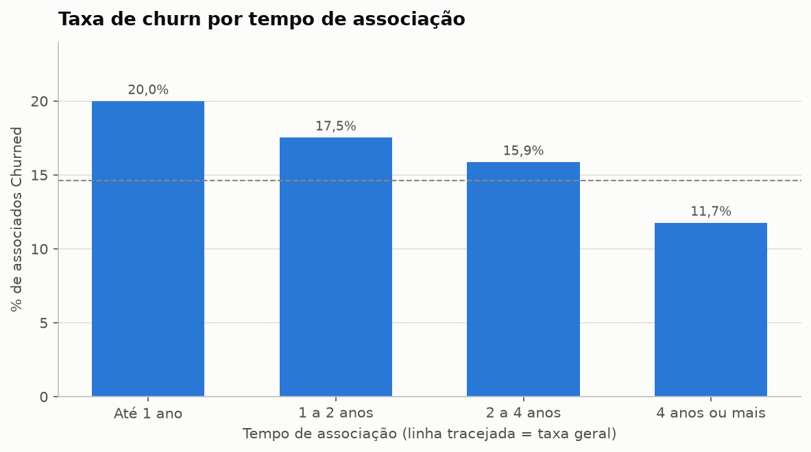

# CRM Marketing Analytics: Associados de uma Cooperativa Financeira

Análise de perfil e comportamento de associados de uma cooperativa financeira, com foco em
marketing, segmentação e churn. O projeto cobre a geração da base, a análise exploratória em
Python, a segmentação RFV, o NPS, o churn, os KPIs de campanhas, as consultas em SQL que
reproduzem os principais números e um dashboard no Power BI.

> **Aviso:** os dados deste projeto são **simulados**. As relações entre as variáveis (por exemplo,
> mais produtos levando a um NPS maior) foram definidas na etapa de geração da base. Os insights
> abaixo demonstram o método de análise e **não representam fatos sobre nenhuma empresa real**.


## Análises realizadas

0. **Geração dos dados:** 5.000 associados com semente fixa e relações realistas entre as variáveis
   (canal, idade, segmento, produtos, uso do app, NPS, campanhas e status).
1. **Visão geral da base:** status, distribuição por estado, segmento e canal, idade e evolução
   das novas associações.
2. **Produtos e cross-sell:** penetração de cada produto, média de produtos por associado,
   correlação entre produtos e público de oportunidade para cartão de crédito.
3. **Segmentação RFV:** recência, frequência e valor dos associados ativos, normalizados com
   `MinMaxScaler`, e classificação em Em risco, Atenção, Potencial e Premium.
4. **NPS:** promotores, neutros e detratores; NPS geral e por segmento, estado e canal; relação
   com a quantidade de produtos e com o uso do app.
5. **Churn:** taxa geral, por segmento e por tempo de associação; perfil Churned x Ativo e
   variáveis que mais diferenciam os dois grupos.
6. **KPIs de marketing:** taxas de abertura e conversão por segmento e por canal de aquisição e
   priorização de segmentos para campanhas.
7. **Resumo executivo:** tabela de KPIs e principais insights.

As mesmas perguntas de negócio foram reproduzidas em SQL (`sql/queries_analiticas.sql`):
top cidades, cross-sell, NPS por segmento, perfil Ativo x Churned, taxas por canal e
distribuição RFV.

## Stack

- **Python:** pandas, numpy, matplotlib, seaborn, scikit-learn
- **SQL**
- **Jupyter Notebook**
- **Power BI:** modelo com relacionamentos entre as tabelas, medidas em DAX e dashboard de 4 páginas

## Principais resultados

| Indicador | Valor |
|---|---|
| Total de associados | 5.000 |
| Associados ativos | 3.524 (70,5%) |
| Taxa de churn | 14,6% |
| NPS geral | 21,8 |
| Média de produtos por associado | 2,20 |
| Taxa de abertura de campanhas | 39,9% |
| Taxa de conversão de campanhas | 15,3% |
| Saldo médio em conta corrente (associados com conta) | R$ 8.057,30 |

## Dashboard no Power BI

O dashboard tem 4 páginas, todas com filtros por segmento, estado e canal de aquisição. Os
indicadores foram criados como medidas em DAX e usam as mesmas definições do notebook, então os
números são os mesmos nas três camadas do projeto (Python, SQL e Power BI). A primeira página,
Visão geral, é a imagem do início deste README.

### Produtos e NPS


### Churn e RFV


### Campanhas


Para abrir o dashboard, use o arquivo `powerbi/dashboard_marketing_crm.pbip` no Power BI Desktop.
Os prints acima mostram os dados já carregados. Para carregar ou atualizar os dados em outra
máquina, ajuste a fonte das consultas `associados` e `associados_rfv` (em Transformar dados) para o
caminho dos CSVs da pasta `data/`.

## Insights em destaque

1. **Mais produtos, mais satisfação e menos churn.** O NPS vai de -38,9 entre quem não tem
   nenhum produto para 85,8 entre quem tem 5 ou mais, e os associados que saíram tinham 46% menos
   produtos que os ativos (1,31 contra 2,44). Aumentar a vinculação é a principal alavanca de
   retenção.
2. **O primeiro ano é o período mais crítico.** O churn chega a 20,0% entre quem tem até 1 ano de
   associação, contra 11,7% entre quem tem 4 anos ou mais. Queda em transações e em acessos ao
   app é o sinal de alerta para agir antes da saída.
3. **Pessoa Física concentra o risco.** O segmento tem o maior churn (16,8%), o menor NPS (17,7)
   e 33,5% dos seus ativos na classe RFV Em risco. É a prioridade para campanhas de retenção.
4. **Há um público pronto para cross-sell.** São 977 associados ativos com conta corrente e sem
   cartão de crédito (30,6% dos ativos com conta). Como o cartão é o produto mais ligado aos
   demais, ele também abre caminho para seguro e consórcio.
5. **O canal de aquisição muda a resposta às campanhas.** Quem entrou pelo Digital abre mais
   campanhas (49,2%), e quem entrou por Indicação converte mais (21,6%).

### NPS por quantidade de produtos e por uso do app


### Churn por tempo de associação



### Perfil dos segmentos RFV


## Como rodar

1. Clone o repositório:

   ```bash
   git clone https://github.com/kevin-sachetti/crm-marketing-analytics.git
   cd crm-marketing-analytics
   ```

2. Crie e ative um ambiente virtual:

   ```bash
   python -m venv .venv

   # Windows
   .venv\Scripts\activate

   # Linux / macOS
   source .venv/bin/activate
   ```

3. Instale as dependências:

   ```bash
   pip install -r requirements.txt
   ```

4. Abra o notebook:

   ```bash
   jupyter notebook notebooks/analise_marketing_crm.ipynb
   ```

   Ao executar todas as células, a base é gerada de novo em `data/` e os gráficos são salvos em
   `assets/`. Como a semente é fixa, os resultados são sempre os mesmos.

As queries de `sql/queries_analiticas.sql` usam as tabelas `associados`
(`data/associados_simulados.csv`) e `associados_rfv` (`data/associados_rfv.csv`) e podem ser
executadas em qualquer banco que carregue esses CSVs (DuckDB, PostgreSQL, SQL Server, entre outros).

## Estrutura de pastas

```
crm-marketing-analytics/
├── README.md
├── LICENSE
├── requirements.txt
├── .gitignore
├── data/
│   ├── associados_simulados.csv     # base de associados gerada no notebook
│   └── associados_rfv.csv           # scores e classes RFV dos associados ativos
├── notebooks/
│   └── analise_marketing_crm.ipynb  # geração dos dados e análises
├── sql/
│   └── queries_analiticas.sql       # consultas analíticas comentadas
├── powerbi/
│   ├── dashboard_marketing_crm.pbip # arquivo para abrir o dashboard no Power BI Desktop
│   ├── dashboard_marketing_crm.Report/         # páginas e visuais do relatório
│   └── dashboard_marketing_crm.SemanticModel/  # tabelas, relacionamentos e medidas DAX
└── assets/                          # gráficos exportados do notebook e prints do dashboard
```
