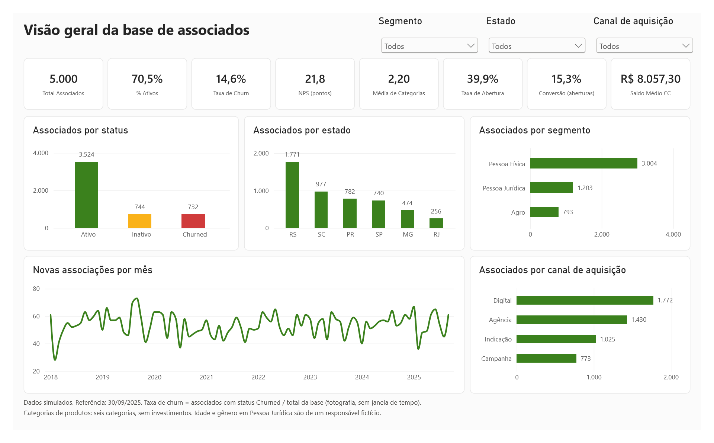
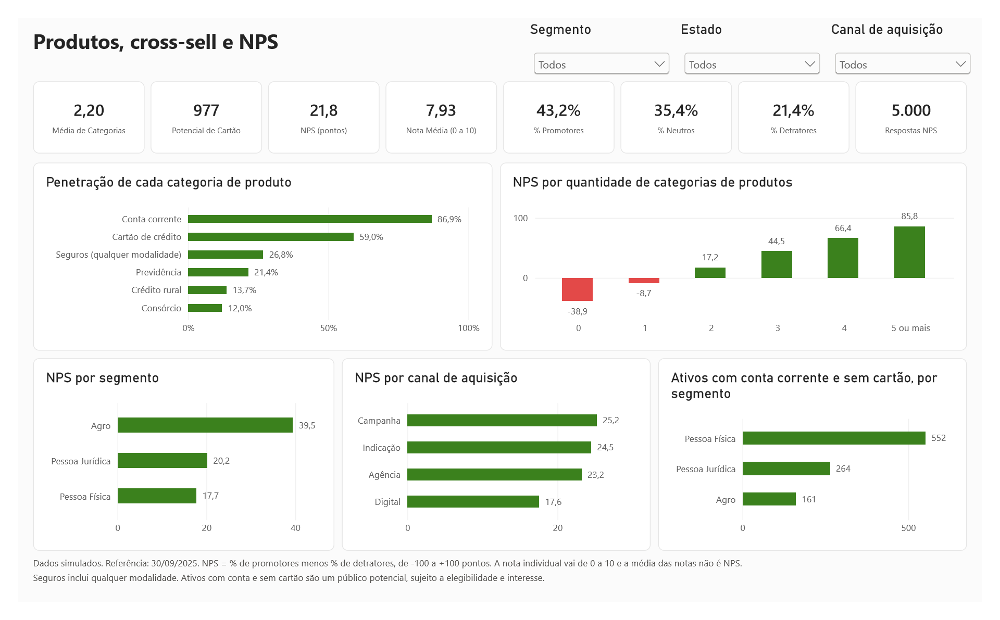
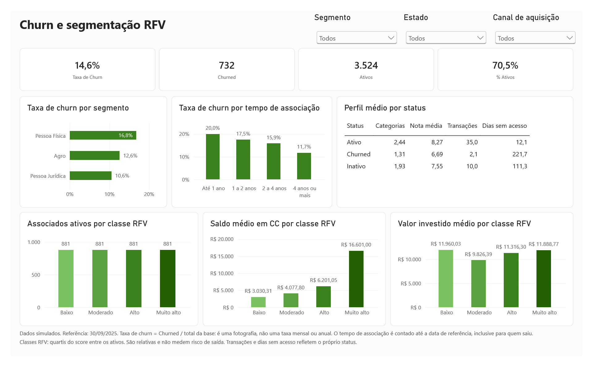
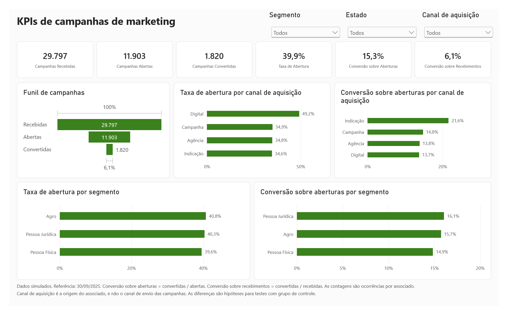
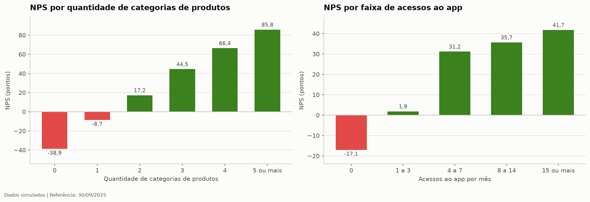
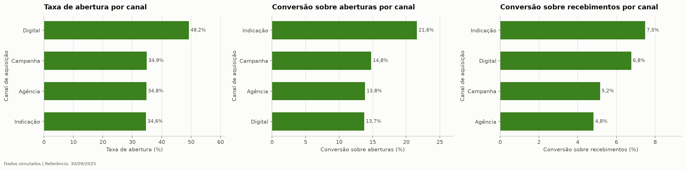
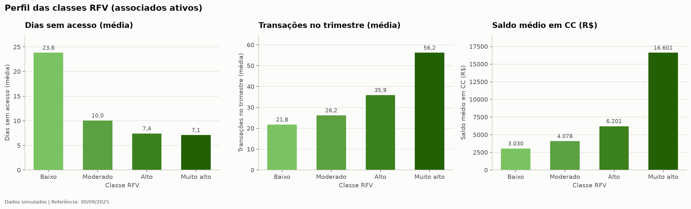

# CRM Marketing Analytics: Associados de uma Cooperativa Financeira

Análise de perfil e comportamento de associados de uma cooperativa financeira, com foco em
marketing, segmentação e churn. O projeto cobre a geração da base, a análise exploratória em
Python, a segmentação RFV, o NPS, o churn, os KPIs de campanhas, as consultas em SQL que
reproduzem os principais números e um dashboard no Power BI.

> **Aviso:** os dados deste projeto são **simulados**, com data de referência em 30/09/2025. As
> relações entre as variáveis (por exemplo, mais categorias de produtos junto com notas de
> recomendação mais altas) foram definidas na etapa de geração da base. Os insights abaixo
> demonstram o método de análise. Eles **não representam fatos sobre nenhuma empresa real** e não
> provam relações de causa e efeito.



## Análises realizadas

0. **Geração dos dados:** 5.000 associados com semente fixa e relações realistas entre as variáveis
   (canal, idade, segmento, produtos, uso do app, nota de recomendação, campanhas e status).
1. **Visão geral da base:** status, distribuição por estado, segmento e canal, idade e evolução
   das novas associações.
2. **Produtos e cross-sell:** penetração de cada categoria de produto, média de categorias por
   associado, correlação entre as categorias e público potencial para cartão de crédito.
3. **Segmentação RFV:** recência, frequência e valor dos associados ativos, normalizados com
   `MinMaxScaler`, e classificação em Baixo, Moderado, Alto e Muito alto.
4. **NPS:** promotores, neutros e detratores; NPS geral e por segmento, estado e canal; nota média
   de recomendação; relação com a quantidade de categorias de produtos e com o uso do app.
5. **Churn:** taxa geral, por segmento e por tempo de associação; perfil Churned x Ativo e
   variáveis que mais diferenciam os dois grupos.
6. **KPIs de marketing:** taxa de abertura, conversão sobre aberturas e conversão sobre
   recebimentos, por segmento e por canal de aquisição, e priorização de segmentos para campanhas.
7. **Resumo executivo:** tabela de KPIs, principais insights e limites da análise.

As mesmas perguntas de negócio foram reproduzidas em SQL (`sql/queries_analiticas.sql`), em 8
consultas: top cidades, cross-sell, NPS por segmento, perfil Ativo x Churned, taxas por canal,
distribuição RFV, indicadores gerais e composição do NPS.

As definições de todos os campos e indicadores estão no
[dicionário de dados](docs/dicionario_dados.md).

## Stack

- **Python:** pandas, numpy, matplotlib, seaborn, scikit-learn
- **SQL**
- **Jupyter Notebook**
- **Power BI:** modelo com relacionamentos entre as tabelas, medidas em DAX e dashboard de 4 páginas

## Principais resultados

| Indicador | Valor | Definição |
|---|---|---|
| Total de associados | 5.000 | Uma linha por associado |
| Associados ativos | 3.524 (70,5%) | Status Ativo |
| Taxa de churn | 14,6% | Churned / total da base, na fotografia de 30/09/2025 |
| NPS geral | 21,8 pontos | % de promotores menos % de detratores (de -100 a +100) |
| Nota média de recomendação | 7,93 | Média das notas, de 0 a 10. Não é o NPS |
| Média de categorias de produtos por associado | 2,20 | Seis categorias, sem investimentos |
| Taxa de abertura de campanhas | 39,9% | Campanhas abertas / recebidas |
| Conversão sobre aberturas | 15,3% | Campanhas convertidas / abertas |
| Conversão sobre recebimentos | 6,1% | Campanhas convertidas / recebidas |
| Saldo médio em conta corrente | R$ 8.057,30 | Entre os associados com conta |

## Dashboard no Power BI

O dashboard tem 4 páginas, todas com filtros por segmento, estado e canal de aquisição. Os
indicadores foram criados como medidas em DAX e usam as mesmas definições do notebook, então os
números são os mesmos nas três camadas do projeto (Python, SQL e Power BI). Cada página traz uma
nota com as definições e os limites dos indicadores. A primeira página, Visão geral, é a imagem
do início deste README.

### Produtos e NPS



### Churn e RFV



### Campanhas



Para abrir o dashboard, use o arquivo `powerbi/dashboard_marketing_crm.pbip` no Power BI Desktop.
Os prints acima mostram os dados já carregados. O caminho dos CSVs fica em um único parâmetro,
chamado `PastaDados`. Para carregar ou atualizar os dados em outra máquina, altere esse parâmetro
(em Transformar dados, Editar parâmetros) para o caminho da pasta `data/` no seu computador,
terminando com uma barra invertida. Exemplo: `C:\projetos\crm-marketing-analytics\data\`.

## Insights em destaque

Os insights descrevem o que a análise mostra nesta base simulada e apontam hipóteses para testar
em dados reais.

1. **Relacionamento mais amplo aparece junto com mais recomendação e menos churn.** O NPS vai de
   -38,9 entre quem não tem nenhuma categoria de produto para 85,8 entre quem tem 5 ou mais, e os
   associados Churned têm 46% menos categorias que os ativos (1,31 contra 2,44). Hipótese: ampliar
   o relacionamento ajuda a reter.
2. **Pessoa Física concentra os pontos de atenção.** O segmento tem a maior taxa de churn (16,8%),
   o menor NPS (17,7) e 33,5% dos seus ativos na classe RFV Baixo. É o primeiro público para ações
   de retenção.
3. **Há um público potencial para cross-sell de cartão.** São 977 associados ativos com conta
   corrente e sem cartão de crédito (30,6% dos ativos com conta), sujeitos a elegibilidade e
   interesse. O cartão é a categoria mais ligada às demais, então também pode abrir caminho para
   seguros e consórcio.
4. **A origem do associado muda a resposta às campanhas.** Quem entrou pelo Digital abre mais
   campanhas (49,2%), e quem entrou por Indicação converte mais (21,6% das aberturas). Isso vale
   para a origem do associado, e não para o canal de envio das campanhas.
5. **O funil de campanhas precisa de dois denominadores.** A conversão é de 15,3% sobre as
   aberturas e de 6,1% sobre os recebimentos. Acompanhar os dois evita superestimar o resultado.

### NPS por quantidade de categorias de produtos e por uso do app



### Resposta às campanhas por canal de aquisição



### Perfil das classes RFV



## Limites da análise

- Os dados são simulados e as relações entre as variáveis foram definidas na geração. Os
  resultados mostram associações, e não causas.
- A taxa de churn é uma fotografia da base em 30/09/2025, sem data de saída. Não é uma taxa
  mensal ou anual.
- O tempo de associação é contado até a data de referência, inclusive para quem saiu. A comparação
  por tempo de associação não mede o risco no primeiro ano.
- Uso do app, transações e dias sem acesso são ajustados depois do status na geração dos dados.
  Nesta base, não servem como sinal antecipado de saída.
- As classes RFV são relativas (quartis dos ativos) e não medem risco de saída.
- O canal de aquisição é a origem do associado, e não o canal de envio das campanhas.
- A base registra seis categorias de produtos, sem investimentos. "Seguros" indica a posse de
  pelo menos um seguro, de qualquer modalidade.
- Idade e gênero, nos registros de Pessoa Jurídica, são de um responsável fictício pela empresa.

## Como rodar

1. Clone o repositório:

   ```bash
   git clone https://github.com/kevin-sachetti/crm-marketing-analytics.git
   cd crm-marketing-analytics
   ```

2. Crie e ative um ambiente virtual:

   ```bash
   python -m venv .venv

   # Windows
   .venv\Scripts\activate

   # Linux / macOS
   source .venv/bin/activate
   ```

3. Instale as dependências:

   ```bash
   pip install -r requirements.txt
   ```

4. Abra o notebook:

   ```bash
   jupyter notebook notebooks/analise_marketing_crm.ipynb
   ```

   Ao executar todas as células, a base é gerada de novo em `data/` e os gráficos são salvos em
   `assets/`. Como a semente é fixa, os resultados são sempre os mesmos.

As queries de `sql/queries_analiticas.sql` usam as tabelas `associados`
(`data/associados_simulados.csv`) e `associados_rfv` (`data/associados_rfv.csv`). Elas foram
testadas no DuckDB e usam SQL padrão. Em outros bancos pode ser preciso um ajuste pequeno, como
trocar `LIMIT` por `TOP` no SQL Server.

## Estrutura de pastas

```
crm-marketing-analytics/
├── README.md
├── LICENSE
├── requirements.txt
├── .gitignore
├── data/
│   ├── associados_simulados.csv     # base de associados gerada no notebook
│   └── associados_rfv.csv           # scores e classes RFV dos associados ativos
├── notebooks/
│   └── analise_marketing_crm.ipynb  # geração dos dados e análises
├── sql/
│   └── queries_analiticas.sql       # consultas analíticas comentadas
├── docs/
│   └── dicionario_dados.md          # campos, indicadores e limites da base
├── powerbi/
│   ├── dashboard_marketing_crm.pbip # arquivo para abrir o dashboard no Power BI Desktop
│   ├── dashboard_marketing_crm.Report/         # páginas e visuais do relatório
│   └── dashboard_marketing_crm.SemanticModel/  # tabelas, relacionamentos e medidas DAX
└── assets/                          # gráficos exportados do notebook e prints do dashboard
```
